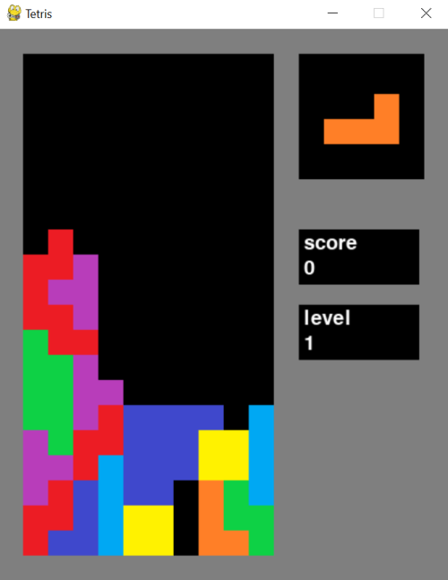

# Käyttöohje

# Käynnistäminen

Asenna ensin riippuvuudet komennolla `poetry install`.

Käynnistä sitten ohjelma komennolla `poetry run invoke start`

# Pelin ohjeet

Peli alkaa saman tien kun ohjelma käynnistetään.

Pelikentälle ilmestyy tetromino, joka putoaa alaspäin. 
Tetrominoa voi ohjata nuolinäppäimillä oikealle ja vasemmalle, kääntää ylänuolella, pudottaa nopeammin alanuolesta sekä pudottaa heti välilyönnillä.

Kun jokin rivi saadaan täyteen, se poistuu pelikentältä.

Peli loppuu, kun uusi tetromino ei enää mahdu ruudulle.

