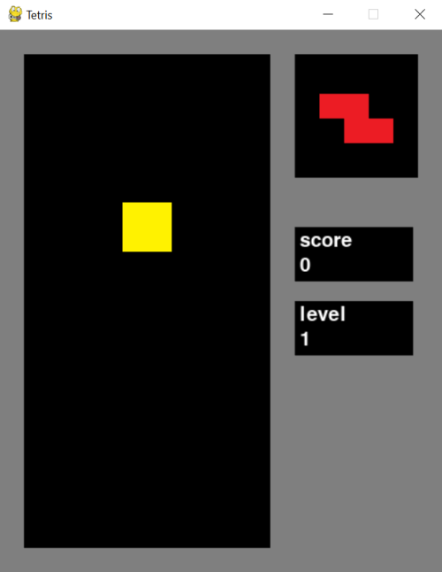

# Käyttöohje

Lataa tietokoneellesi projektin uusin [release](https://github.com/hilliaho/ot-harjoitustyo/releases/tag/viikko7).

# Käynnistäminen

Asenna riippuvuudet komennolla `poetry install`.

Käynnistä sen jälkeen ohjelma komennolla `poetry run invoke start`.

# Pelin ohjeet

Sovelluksen käynnistyttyä näkyviin tulee tyhjä pelikenttä. Peli alkaa painamalla hiirellä START GAME -napista tai näppäimistöltä välilyönnistä tai palautusnäppäimestä (Enter).

Kun peli aloitetaan, pelikentän yläreunaan ilmestyy tetromino, joka lähtee putoamaan alaspäin. 
Tetrominoa voi ohjata nuolinäppäimillä oikealle ja vasemmalle, kääntää ylänuolella, pudottaa nopeammin alanuolella sekä pudottaa heti välilyönnillä.
Pelikentän vieressä näkyy seuraavaksi tuleva tetromino.

Tetrominoja ohjaillaan toistensa lomaan. Kun jokin pelikentän rivi saadaan täyteen, se poistuu pelikentältä. Poistetuista riveistä saa pisteitä. Pisteitä riviä kohden saa sitä enemmän, mitä enemmän rivejä poistaa kerralla.

|poistettavat rivit|pisteet|
|---|---|
|1|1|
|2|4|
|3|9|
|4|16|

Pisteet ja taso näkyvät koko pelin ajan pelinäkymän oikeassa reunassa. Kun pistemäärä nousee tarpeeksi korkealle, myös pelin taso nousee. Tason noustessa tetrominojen kopeus kasvaa.

Peli loppuu, kun uusi tetromino ei enää mahdu ruudulle. Tällöin oikeaan alakulmaan ilmestyy GAME OVER -teksti.

